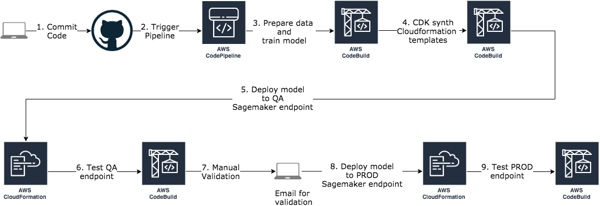
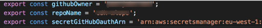

# Amazon Sagemaker MLOps Pipelines

This git repo contains examples on how to automate typical ML workflows using operational excellence as defined in the AWS Well-Architected framework:

https://wa.aws.amazon.com/wat.pillar.operationalexcellence.en.html

## The ML workflow

The following diagram illustrates the typical workflow for creating a machine learning model:


For more details go to this page:

https://docs.aws.amazon.com/sagemaker/latest/dg/how-it-works-mlconcepts.html

### Automation

An ML workflow is an iterative process which involves more than a data scientist training models in a Jupyter Notebook. In order to get value out of a model, we also need to be able to deploy and monitor these models for inference. Amazon Sagemaker can cover most of the steps in the workflow, but in order to  follow the priniciples of operation excellence we need to automate the workflow as much as possible. We can do this using Infrastructure as Code and code pipelines.

In the examples in this repo we create the ML code pipelines and the model deployments using Infrastructure as code created with the Cloud Development Kit (**CDK**) framework:

https://github.com/awslabs/aws-cdk

Each example will create a code pipeline that looks likes this:





## Getting started

### CDK

We will be using the CDK framework when developing our infrastructure as code and you therefore need to install the framework on your computer. If you have never used CDK before then it is highly recommended to try out this workshop:

https://cdkworkshop.com/

The examples in this repo are based on CDK version 0.30.0 so you either need to install that version or go in and change the CDK packages in the packages.json files to use the versions matching your CDK version.

```bash
npm install -g aws-cdk@0.30.0
```

### Github Repo

The code pipeline uses this github repo as source and you should therefore start by forking this repo and clone it on your computer.

The pipeline is triggered on each git push so you will need to create a github personal access token with **admin:repo_hook, repo** rights:

https://github.com/settings/tokens

The pipeline code fetches this token from the AWS Secrets Manager in your AWS account. Store the github token in AWS Secrets Manager using a secret called for example **github-personal-access-token**. You can create it using the AWS console:

https://console.aws.amazon.com/secretsmanager/home#/listSecrets

or you can create it using the aws sdk:

```bash
aws secretsmanager create-secret --name 'github-personal-access-token' --secret-string mygithubtoken
```

Your github repo, your github owner and your AWS Secret ARN should be used as config values in the **config.ts** file found in the root of the repo:




## Repo structure

The various steps in the ML workflow is handled by code defined in the following folders:

[ml-init](ml-init/README.md): initializes an example by creating an S3 bucket with the training data and in some cases also creates other AWS resources used by the training code, e.g. a glue database, a glue crawler etc.

[ml-pipeline](ml-pipeline/README.md): contains the code pipeline used by all the examples.

[ml-training](ml-training/README.md): contains the data prepare code and model training code which is executed using AWS CodeBuild.

[ml-backend](ml-backend/README.md): contains the CDK stacks used when deploying either a QA or PROD Sagemaker endpoint.

[ml-test](ml-test/README.md): contains code that tests the endpoint and will throw an assert error if the model quality is not acceptable. The error will block the code pipeline from deploying to the PROD endpoint.

## Examples

### Movie recommender using Factorization Machines

This example is inspired by the movie recommender blog post by Julien Simon:

https://medium.com/@julsimon/building-a-movie-recommender-with-factorization-machines-on-amazon-sagemaker-cedbfc8c93d8

To try out this example go here: 

### Iris flower categorization using TensorFlow

This example is inspired by the Iris DNN Tensorflow example that is part of the Sagemaker examples:

https://github.com/awslabs/amazon-sagemaker-examples/blob/master/sagemaker-python-sdk/tensorflow_iris_dnn_classifier_using_estimators/tensorflow_iris_dnn_classifier_using_estimators.ipynb

To try out this example go here:

